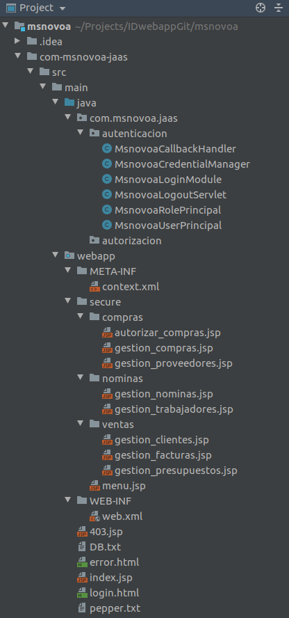
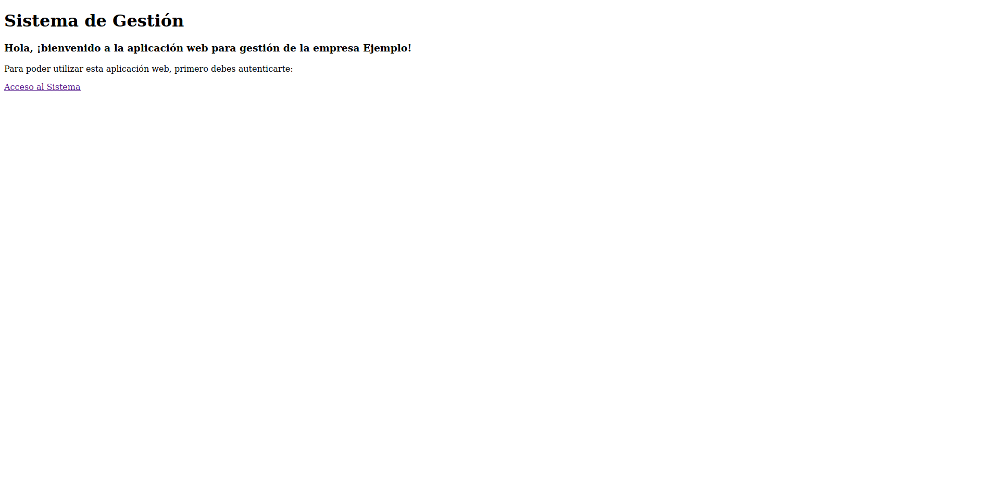
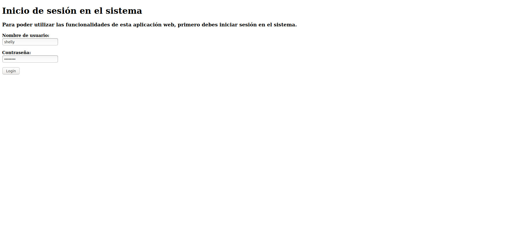
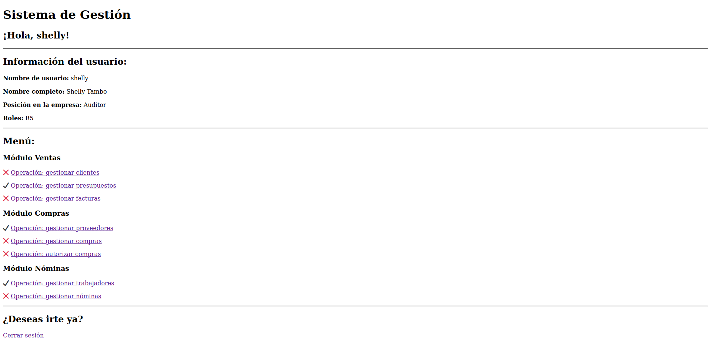

# ID web app msnovoa

Aplicación web para la gestión de un sistema privado de una pequeña empresa que se dedica a la importación y distribución de productos. La aplicación realizará el control de acceso basado en roles (RBAC) que ofrece el contenedor de aplicaciones Apache Tomcat, junto con el de uso de Java Authentication and Authorization Services (JAAS).

Dentro de esta aplicación se gestionará tanto la autenticación como la autorización dentro del sistema, en función de usuarios y sus roles.

> ATENCIÓN: En el desarrollo de esta aplicación web, se utilizaron las siguientes tecnologías, versiones anteriores de las mismas podrían no ser compactibles: Java SE Development Kit (JDK) [versión 9]; servlet container Apache Tomcat [versión 9].

> Esta aplicación incluye un vídeo de demo de su funcionamiento, así como un segundo vídeo explicando más detalladamente el código y estructura del proyecto. Ambos se encuentran en la carpeta de Vídeos.

---

##  Índice

- [Contexto de la estructura de la empresa que utiliza esta aplicación](#Contexto-de-la-estructura-de-la-empresa-que-utiliza-esta-aplicación)
- [Estructura del proyecto](#Estructura-del-proyecto)
- [Proceso de autenticación](#Proceso-de-autenticación)
- [Proceso de autorización](#Proceso-de-autorización)
- [Código web](#Código-web)
- [Galería](#Galería)  

---

## Contexto de la estructura de la empresa que utiliza esta aplicación

Para compreender el funcionamiento de la aplicación en el momento de su ejecución, se indicará brevemente la estructura interna de la empresa que usará dicha aplicación, para compreender mejor los requisitos necesarios que se deben alcanzar.

#### Lista de usuarios y credenciales que interactuarán con la aplicación securizada

|  Usuario | Cargo  | Login  | Password  |
|---|---|---|---|
| Joel Fleischman  | Gerente  | joel  | d0ct0r78  |
| Maggie O'Connell  | Jefe de Ventas  | maggie  | p1l0t678  |
| Chris Stevens  | Jefe de Personal  | chris  | r4d10678  |
| Maurice Minnifield  | Jefe de Compras  | maurice  | 4stron78  |
| Shelly Tambo  | Auditor  | shelly  | w41tr3ss  |

#### Roles existentes

| Rol  | Descripción  |
|---|---|
| R1  | Autoriza las compras  |
| R2  | Gestión de clientes, facturas y presupuestos  |
| R3  | Gestión de nóminas y de trabajadores  |
| R4  | Gestión de compras y de proveedores  |
| R5  | Auditor  |

#### Asignación de roles

| Personal  | Roles  |
|---|---|
| Joel Fleischman  | R1, R2, R3, R4  |
| Maggie O'Connell  | R2  |
| Chris Stevens  | R3  |
| Maurice Minnifield  | R4  |
| Shelly Tambo  | R5  |

#### Roles necesarios para la ejecución de operaciones seguras

| Operación  | Roles  |
|---|---|
| Gestión de nóminas  | R3  |
| Gestión de trabajadores  | R3, R5  |
| Autorizar compras  | R1  |
| Gestión de compras  | R4  |
| Gestión de proveedores  | R4, R5  |
| Gestión de clientes  | R2  |
| Gestión de facturas  | R2  |
| Gestión de presupuestos  | R2, R5  |

---

## Estructura del proyecto

El proyecto está organizado siguiendo la siguiente estructura de archivos:



---

## Proceso de autenticación

En esta sección del documento se indicará el proceso de autenticación realizado por la aplicación. Esta explicación de realizará de manera sencilla ya que la información existente en los vídeos amplían los datos que aquí se muestran.

Para el proceso de autenticación, la aplicación hace uso de las clases Java que se encuentran dentro de ```msnovoa/com-msnovoa-jaas/src/main/java/com/msnovoa/jaas/autenticacion/```

#### Login

El proceso de autenticación comenzaría cuando se intenta realizar un login en el sistema. Para ello, contamos con la clase **MsnovoaLoginModule**.

Cuando, a través de la web, un usuario intenta acceder al sistema, indica sus credenciales, que serán enviadas mediante un formuario POST y llegarían hasta la aplicación Java, que las recogería gracias al método ```login``` perteneciente al LoginModule. En esta función ocurriría lo siguiente:

1. Las credenciales de acceso son recogidas en un **CallbackHandler**, que también fue personalizado en la clase **MsnovoaCallbackHandler**.
2. Recogidas las informaciones por el CallbackHandler, se obtienen en el método ```login``` y se almacenan en variables.
3. Llamamos a otra clase, **MsnovoaCredentialManager** que se trata de la clase encargada de interactuar con el fichero de la base de datos y comprobar que un usuario existe en el sistema. Será explicada detalladamente más adelante.
4. Tras la comprobación de que el usuario existe en el sistema, tendríamos dos posibles caminos:
    - Error, el usuario no se encuentra o la contraseña es incorrecta: En este caso, se devuelve un valor nulo y la función de ```login``` llega a su final. En este caso llamaría a una función ```abort``` básica y acabaría.
    - El usuario existe y sus credenciales son correctas: Se recuperan todos los datos del usuario leídos desde la base de datos y devueltos por la clase **MsnovoaCredentialManager**. Obtenidos los datos, se añaden todos los Principals correspondientes a ese Subject, tanto los Principals del nombre (clase **MsnovoaUserPrincipal**) como los de los roles (clase **MsnovoaRolePrincipal**). La función de ```login``` y en este caso llama a una también muy simpe función de ```commit```.

#### Acceso a la base de datos y comprobación de credenciales

Se indicará ahora el mecanismo de acceso a la base de datos y comprobación de las credenciales. Todo esto se realiza dentro de la clase **MsnovoaCredentialManager**:

La función principal de esta clase se trata de ```verifyCredentials```, que se encargará de recibir un callback con la información del login y devolver toda la información relativa a ese usuario tras acceder a la base de datos. El proceso es el siguiente:

1. Recibimos la información del login y la almacenamos en variables locales.
2. Se abre el fichero de base de datos, en este caso, un .txt al estilo Shadows.
3. Se van leyendo una por una todas las líneas del fichero y se comprueba si el valor del usuario es correspondiente con alguno de los registrados.
    - En caso negativo, se llegará al final del fichero sin encontrar nada. Se indicarán los valores del usuario como un objeto nulo y se devolverá.
    - En caso de que alguna de las líneas sea coincidente, se llamará a otra función para realizar el cifrado de la contraseña. Antes de esto, también se recuperará el pepper desde un fichero. Recibida la contraseña cifrada, se comprueba si es igual a la almacenada en la base de datos; de ser así, se obtienen todos los valores del usuario y se devuelven.
    
#### Cifrado de la contraseña

Como hemos visto, para comprobar la contraseña con el valor almacenado en la base de datos en el punto anterior, es preciso compararlo con un valor cifrado, por lo que explicaremos ahora el proceso a realizar en este método ```stringToSHA1KeyStretching```:

Este método recibe como parámetros un salt (formado por el salt almacenado en la base de datos más el pepper) y la contraseña sin cifrar, devolviendo finalmente la contraseña cifrada.

La contraseña será cifrada mediante el algoritmo SHA-1 y aplicando *Key Stretching* mediante PBKDF2. Para ello, utilizaremos funciones existentes en Java:

```java
byte[] saltByte = salt.getBytes(StandardCharsets.UTF_8);
KeySpec keySpec = new PBEKeySpec(input.toCharArray(), saltByte, 3000000, 128);
SecretKeyFactory secretKeyFactory = SecretKeyFactory.getInstance("PBKDF2WithHmacSHA1");
byte[] passwordSHA1Byte = secretKeyFactory.generateSecret(keySpec).getEncoded();
```

En este caso, el mecanismo de *Key Stretching* mediante PBKDF2 realiza un total de 3000000 iteraciones. Deberían ser adaptadas en función del servidor a utilizar.

#### Logout

Dentro de la clase **MsnovoaLoginModule** también se encuentra la función ```logout```. En esta función se eliminan todos los principals existentes, de nombre y de roles. Esta función sería llamada cuando desde la web se llama al Servlet **MsnovoaLogoutServlet**, el cual se encarga de cerrar la sesión HTTP actual, llamar a la función nombrada y redirigir al usuario hasta la página de inicio.

---

## Proceso de autorización

El proceso de autorización se llevará a cabo gracias a las configuraciones de la aplicación web con Tomcat y JAAS. Concretamente, existen dos ficheros de configuración importantes:

#### context.xml

Incluye la información relativa al Real a utilizar, en este caso indicaremos que se empleará JAAS. También el nombre de nuestra aplicación así como las clases de los Principals.

```xml
<?xml version="1.0" encoding="UTF-8"?>
<Context>
	<Realm className="org.apache.catalina.realm.JAASRealm" appName="MsnovoaWebID"
		   userClassNames="com.msnovoa.jaas.autenticacion.MsnovoaUserPrincipal" roleClassNames="com.msnovoa.jaas.autenticacion.MsnovoaRolePrincipal" />
</Context>
```

#### web.xml

Donde se definirá toda la política de autorización, siguiendo el estilo de aplicaciones web Tomcat. Entre otros, se indica:

- Especificación de las páginas de login y error, así como el método a emplear (un form):

```xml
<login-config>
    <auth-method>FORM</auth-method>
    <form-login-config>
        <form-login-page>/login.html</form-login-page>
        <form-error-page>/error.html</form-error-page>
    </form-login-config>
</login-config>

<error-page>
    <error-code>403</error-code>
    <location>/403.jsp</location>
</error-page>
```

- Los roles existentes en la aplicación web, siguiendo una estructura similar a la siguiente:

```xml
<security-role>
    <role-name>Rn</role-name>
</security-role>
```

- Los diferentes recursos existentes en la aplicación web, limitando su acceso en función de los roles que posea el usuario. Sigue el siguiente formato:

```xml
<security-constraint>
    <web-resource-collection>
        <web-resource-name>Nombre del recurso</web-resource-name>
        <url-pattern>/secure/path/to/file</url-pattern>
    </web-resource-collection>
    <auth-constraint>
        <role-name>Rn</role-name>
        <role-name>Rx</role-name>
    </auth-constraint>
</security-constraint>
```

Gracias a la definición de estos ficheros de configuración, la aplicación invocará a los métodos JAAS explicados anteriormente cuando haya que realizar la autenticación y, en función de los roles indicados en **web.xml** se procederá a conceder (o no) la autorización de acceso a zonas seguras.

---

## Código web

La mayoría de las páginas web se tratan de simples HTML sin mayor complejidad. Sin embargo, algunas partes del código pueden ser interesantess de comentar.

Concretamente, en la página /secure/menu.jsp, donde debe ser mostrada la información del usuario, esta se recoge obteniendo el msnovoaUserPrincipal. Posteriormente, para mostrar los datos se realizan las siguientes operaciones en un pequeño código Java integrado dentro de este jsp:

```java
MsnovoaUserPrincipal msnovoaUserPrincipal = (MsnovoaUserPrincipal) request.getUserPrincipal();

String[] allRoles = {"R1","R2","R3", "R4", "R5"};
ArrayList userRoles = new ArrayList(allRoles.length);
for(String role : allRoles) {
    if(request.isUserInRole(role)) {
        userRoles.add(role);
    }
}
String userRolesString = String.join(", ", userRoles);
```

Dentro del código HTML de la web, invocamos a estos datos de esta manera:

```html
<h2>¡Hola, <%= msnovoaUserPrincipal.getName() %>!</h2>
```

Finalmente, indicar que también se muestran unos iconos en función de si el usuario pertenece a los grupos (posee los roles) necesarios para la ejecución de ciertas acciones seguras. El código que determina el icono a mostrar el siguiente, basado en if else en función de los roles encontrados:

Parte Java:

```java
String rGestionNominas = (userRolesString.contains("R3")) ? "✔️" : "❌";
String rGestionTrabajadores = (userRolesString.contains("R3") || userRolesString.contains("R5")) ? "✔️" : "❌";
String rAutorizarCompras = (userRolesString.contains("R1")) ? "✔️" : "❌";
String rGestionCompras = (userRolesString.contains("R4")) ? "✔️" : "❌";
String rGestionProveedores = (userRolesString.contains("R4") || userRolesString.contains("R5")) ? "✔️" : "❌";
String rGestionClientes = (userRolesString.contains("R2")) ? "✔️" : "❌";
String rGestionFacturas = (userRolesString.contains("R2")) ? "✔️" : "❌";
String rGestionPresupuestos = (userRolesString.contains("R2") || userRolesString.contains("R5")) ? "✔️" : "❌";
```

Parte HTML:

```html
<p><%= rGestionClientes %> <a href="ventas/gestion_clientes.jsp">Operación: gestionar clientes</a></p>
```

---

## Galería

Finalmente, se muestran unas imágenes de la aplicación web en uso.








